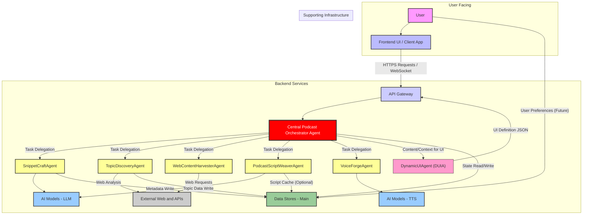

# System_Architecture.md

**Version:** 1.0
**Date:** May 19, 2025

## 1. Overview

This document outlines the high-level system architecture for **Aethercast** (or your chosen app name), an AI-driven podcast application. The architecture is designed to support the dynamic, real-time generation of all content, from landing page snippets to full podcast audio streams, as described in `docs/vision/03_Podcast_App_Manifesto.md`.

The system is built around a central **Podcast Orchestrator Agent** that coordinates various specialized AI agents and services to deliver a unique, generative audio experience to the user.

## 2. System Architecture Diagram

## 3. Major Components & Technologies

Below are descriptions of the major components depicted in the architecture diagram and the likely technologies involved.

### 3.1. User Facing

* **User:** The end-user interacting with the podcast application.
* **Frontend UI / Client App (FEND):**
    * **Description:** The web application or mobile application interface that users interact with. Responsible for displaying podcast snippets, playback controls, and handling user input. It communicates with the backend via the API Gateway. For real-time audio, it will establish a connection for streaming.
    * **Key Responsibilities:**
        * Rendering dynamically generated UI elements (snippets, player).
        * Capturing user interactions (clicks, searches).
        * Initiating requests for podcast generation.
        * Handling real-time audio streaming and playback.
        * Displaying loading states and feedback during generation.
    * **Potential Technologies:**
        * Web: React, Vue, Svelte, Angular with HTML5, CSS3, JavaScript/TypeScript.
        * Mobile: Swift/Objective-C (iOS), Kotlin/Java (Android), React Native, Flutter.
        * Real-time communication for UI updates from CPOA: WebSockets, Server-Sent Events (SSE).
        * Audio Streaming: HTML5 Audio API, WebRTC, HLS/DASH.

### 3.2. Backend Services

* **API Gateway (APIGW):**
    * **Description:** Single entry point for all client requests to the backend. Handles request routing, authentication, authorization, rate limiting, and potentially request/response transformations.
    * **Key Responsibilities:**
        * Expose public endpoints for frontend interaction.
        * Route requests to the Central Podcast Orchestrator Agent.
        * Manage security and access control.
    * **Potential Technologies:** AWS API Gateway, Azure API Management, Google Cloud API Gateway, Kong, Tyk.

* **Central Podcast Orchestrator Agent (CPOA):**
    * **Description:** The "brain" of the application. A sophisticated agent responsible for interpreting user requests, managing the overall workflow of podcast generation, delegating tasks to specialized AI agents, and managing state.
    * **Key Responsibilities:**
        * Receive and interpret requests from the API Gateway.
        * Maintain user session state and context.
        * Coordinate the sequence of operations for snippet and full podcast generation.
        * Delegate tasks to `SnippetCraftAgent`, `TopicDiscoveryAgent`, `WebContentHarvesterAgent`, `PodcastScriptWeaverAgent`, and `VoiceForgeAgent`.
        * Manage agent communication and data flow between agents.
        * Handle errors and retries in the generation pipeline.
        * Send UI update instructions back to the Frontend (e.g., via WebSocket through APIGW or directly).
    * **Potential Technologies:** Python (with frameworks like FastAPI, Flask, or agentic frameworks like Langchain, AutoGen), Node.js, Go. Message queues (RabbitMQ, Kafka, Redis Streams) for inter-agent communication.

* **Specialized AI Agents:**
  These agents perform specific tasks in the content generation pipeline, orchestrated by the CPOA. They are likely implemented as microservices or serverless functions.

    * **`SnippetCraftAgent` (SCA):**
        * **Description:** Generates compelling, short-form text snippets and associated metadata (e.g., titles, potential cover art prompts) for display on the landing page. May also determine which topics are suitable for snippet generation based on input from `TopicDiscoveryAgent`.
        * **Interaction:** Receives tasks from CPOA, uses LLMs from AIMS, writes metadata to Data Stores.
        * **Potential Technologies:** Python, LLM SDKs (OpenAI, Hugging Face Transformers).

    * **`TopicDiscoveryAgent` (TDA):**
        * **Description:** Identifies trending, relevant, or niche topics suitable for podcast generation. May analyze web trends, news feeds, or other sources.
        * **Interaction:** Receives tasks from CPOA, accesses External Web/APIs, writes topic data to Data Stores.
        * **Potential Technologies:** Python, web scraping libraries (Beautiful Soup, Scrapy), news API clients, NLP libraries for trend analysis.

    * **`WebContentHarvesterAgent` (WCHA):**
        * **Description:** Given a specific topic by the CPOA, this agent autonomously browses the web, identifies relevant sources, retrieves, and pre-processes information to form the factual basis of a podcast.
        * **Interaction:** Receives topic from CPOA, accesses External Web/APIs, provides processed content to `PodcastScriptWeaverAgent` (possibly via CPOA or shared storage).
        * **Potential Technologies:** Python, web scraping/Browse automation tools (Selenium, Playwright), content extraction libraries (article-parser, trafilatura).

    * **`PodcastScriptWeaverAgent` (PSWA):**
        * **Description:** An advanced LLM-based agent that takes processed web content, a target persona/style, and the podcast topic to write an engaging, coherent, informative podcast script.
        * **Interaction:** Receives processed content and parameters from CPOA, uses LLMs from AIMS, provides script to `VoiceForgeAgent` (via CPOA). May cache scripts in Data Stores.
        * **Potential Technologies:** Python, LLM SDKs, prompt engineering frameworks.

    * **`VoiceForgeAgent` (VFA):**
        * **Description:** A state-of-the-art Text-to-Speech (TTS) agent that renders the script from PSWA into a natural, high-quality audio stream. Manages voice selection, tone, and pacing.
        * **Interaction:** Receives script from CPOA, uses TTS models from AIMS_TTS, produces audio stream delivered to the user (potentially chunked for real-time streaming).
        * **Potential Technologies:** Python, TTS SDKs/APIs (e.g., ElevenLabs, Azure TTS, Google TTS, Coqui TTS).

    * **`DynamicUIAgent` (DUIA) (Conceptual):**
        * **Description:** Responsible for generating a structured UI Definition JSON based on data from CPOA and user context. This schema instructs the frontend on how to render components, layout, and styles.
        * **Interaction:** Receives content and context from CPOA, outputs UI Definition JSON (which CPOA forwards to APIGW, then to FEND).
        * **Potential Technologies:** Python, logic for programmatic schema construction, (future) rule engines or LLM integration for parts of the schema.

### 3.3. Supporting Infrastructure

* **AI Model Serving Infrastructure (AIMS & AIMS_TTS):**
    * **Description:** Dedicated infrastructure for hosting and serving the various AI models (LLMs for text generation, TTS models for audio synthesis). Optimized for low-latency inference and scalability.
    * **Key Responsibilities:**
        * Provide API endpoints for AI model inference.
        * Manage model versions and deployments.
        * Scale model serving capacity based on demand.
    * **Potential Technologies:** NVIDIA Triton Inference Server, TensorFlow Serving, PyTorch Serve, Seldon Core, KServe, Cloud-specific solutions (AWS SageMaker, Azure Machine Learning, Google Vertex AI). GPUs/TPUs for acceleration.

* **Data Stores (DS):**
    * **Description:** Persistent storage for various types of data required by the application.
    * **Key Responsibilities & Data Types:**
        * **User Session State:** Current context of user interaction (managed by CPOA).
        * **Generated Content Metadata:** Information about snippets, generated scripts (e.g., source URLs, generation parameters for `topics_snippets` and `generated_scripts` tables).
        * **Workflow and Task Instance State (CPOA):** Detailed tracking of CPOA orchestration flows (`workflow_instances` table) and individual agent task statuses (`task_instances` table). This is crucial for observability and debugging.
        * **Topic Cache:** Storing discovered or processed topics (potentially in `topics_snippets` or a dedicated cache).
        * **Script Cache (Optional):** Caching generated scripts (in `generated_scripts` table) to avoid re-generation.
        * **User Preferences (Future):** Storing user feedback or preferences for personalization.
    * **Potential Technologies:**
        * Session/Cache: Redis, Memcached.
        * Metadata/Agent State: PostgreSQL, MySQL, MongoDB, DynamoDB, Firestore.
        * Object Storage (for larger artifacts like cached audio segments if any): AWS S3, Azure Blob Storage, Google Cloud Storage.

* **External Web / APIs (Internet):**
    * **Description:** Represents the public internet, from which the `WebContentHarvesterAgent` and `TopicDiscoveryAgent` retrieve information. This includes websites, news sources, public APIs, etc.
    * **Interaction:** Accessed via standard HTTP/HTTPS protocols.

## 4. Key Considerations

* **Scalability:** All components, especially the AI agents, model serving, and the CPOA, must be designed for horizontal scalability to handle a growing number of users and concurrent generation requests.
* **Latency:** Minimizing latency in the end-to-end podcast generation pipeline (user click -> audio stream start) is critical for user experience. This involves optimizing each agent, model inference, and data transfer.
* **Cost:** AI model inference (especially LLMs and high-quality TTS) can be expensive. The architecture should allow for monitoring and optimizing these costs.
* **Modularity & Maintainability:** A microservices-oriented or agent-based architecture promotes modularity, making the system easier to develop, test, deploy, and maintain.
* **Resilience & Fault Tolerance:** The system should be resilient to failures in individual components or agents. The CPOA should implement error handling, retries, and potentially fallback strategies.
* **Security:** Robust security measures are needed at the API Gateway, for data stores, and for managing access to AI models and external services.

This System Architecture document provides a foundational understanding. More detailed designs for each component and their interactions will be elaborated in subsequent architecture documents (e.g., `Agent_Orchestration.md`, `Data_Flows.md`).
